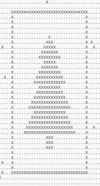
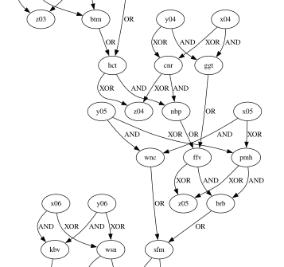

~~# aoc-2024

My solutions for [Advent of Code 2024](https://adventofcode.com/2024).

This year: Learning **[Nim](https://nim-lang.org/)**!

## Execution times

Code in Nim 2.2.0.

* Testing, debugging: `nim compile --run day00.nim`
* Timing: `nim compile -d:release -d:danger day00.nim`

Libraries:

* `bigints`: `nimble install https://github.com/nim-lang/bigints`

| Day    | Time   |
|--------|--------|
| Day 1  | 686μs  |
| Day 2  | 1.98ms |
| Day 3  | 2.24ms |
| Day 4  | 276μs  |
| Day 5  | 22.5ms |
| Day 6  | 350ms  |
| Day 7  | 2.87ms |
| Day 8  | 955μs  |
| Day 9  | 169ms  |
| Day 10 | 1.66ms |
| Day 11 | 7μs    |
| Day 12 | 27.4ms |
| Day 13 | 1.07s  |
| Day 14 | 28s    |
| Day 15 | 587μs  |
| Day 16 | 78.7ms |
| Day 17 | 1.5ms  |
| Day 18 | 12.6ms |
| Day 19 | 69.8ms |
| Day 20 |        |
| Day 21 |        |
| Day 22 | 4.2s   |
| Day 23 | 9.8ms  |
| Day 24 | 0.59ms |
| Day 25 | 0.43ms |

Ranking for all 50 stars: 2863rd place (Almost the same as last year!)
Total runtime (for all 25 days): TODO

## Notes

### Day 6

First map problem, yay! Part 1 was quick, but part 2 took me much longer because I didn't properly think it through and
jumped into coding. There's an edge case (only in part 2) if you insert a blocker `0` just at a place so a right turn
isn't possible, then the guard will have to walk back from where they came from.

Guard approaching:

```
..->...#
......0.
```

Hitting the given wall, unable to turn (or turning 90°, then right again).

```
.....->#
......0.
```

Guard going back.

```
.....<-#
......0.
```

My solution is still somewhat "brute-forcy" (on the given path from part 1, try to insert a blocker `0` at any possible
place), but as it finished within a second I let it be.

### Day 7

Recursion ftw! Solving part 1 was fun and quick, and I started in reverse from the beginning.

With part 2 it took me a while to realize what
"reversing" the `||` means. After figuring out that I misunderstood the problem statement, I was able to figure it out:

```
7290: 6 8 6 15
           * (revert: divide by 15)
486: 6 8  6
        || (revert: remove last 6 from 486)
48: 6 8
     * (revert: divide by 8)
6: 6 ✅
```

### Day 9

Defragmentation of a disk, what a fun challenge. With a simple list (Nim: `sequence`) of integers (representing
fileIds), I could keep track of which file was placed where.

With looping around a bit (and getting rid of _off by one_-errors), it was possible fairly easy to check if the length
of a file would allow it to be placed somewhere else.

### Day 10

Again a map problem today, hooray! Reading through it, it felt familiar, maybe reminding me a bit
of [2023 Day 23](https://adventofcode.com/2023/day/23).
I first thought of using recursion, but after looking at the actual input decided to use a simple queue, so to start
exploring at `0`s and expanding the possible paths by processing queue items. This turned out to be a very good
preparation for part 2 which only required slight changes.

### Day 11

Expanding stones - part 1 was implemented quickly with just following the rules, but it became clear soon enough that
this approach would not work for part 2 (even with a compiled language). After thinking it through some more I gave
Memoization a try, which worked surprisingly well.

### Day 13

Cheat day! Today when reading the problem my mind immediately jumped to equation solving, so I used
Python/[SymPy](https://www.sympy.org/en/index.html), ignoring the "cheapest" condition. The first solution for each
equation was already the right one, and I only found out afterwards that all "vectors" were linearly independent, so I
got lucky.

### Day 14

Wow, what a great puzzle today. I was expecting a big number of seconds in Part 2, but it was really something different
today. Having a puzzle thrown at you which is so unclear was unexpected in AoC and really surprised me. Seeing the
Christmas tree appear in the Console (after only considering solutions with enough neighbouring robots) was really
satisfying.



### Day 15

Part 1 was okay, but after reading part 2 I wasn't motivated at all to solve it. The problem felt really tedious,
especially as it could be any amount of boxes connected which have to be checked (unlike in Sokoban, where two boxes
near each other are already a blocker), like this:

```
move: v, pos: (3, 13), map: 
####################
##[]..[]......[][]##
##[]...........[].##
##...........@[][]##
##..........[].[].##
##..##[]..[].[]...##
##...[]...[]..[]..##
##.....[]..[].[][]##
##........[]......##
####################

move: >, pos: (4, 13), map: 
####################
##[]..[]......[][]##
##[]...........[].##
##............[][]##
##...........@.[].##
##..##[]..[][]....##
##...[]...[].[]...##
##.....[]..[].[][]##
##........[]..[]..##
####################
```

I only solved this part days later, iterating (and collecting) a stack of boxes, first to check if there's enough space,
then backwards to actually move them.

### Day 16

Again a map problem, but a very fun one. Finding the shortest path quickly reminded me of last year and I started early
with a Priority Queue, with a [heapqueue](https://nim-lang.org/docs/heapqueue.html) implementation in Nim.

As it was still running to slowly, I started skipping paths in the queue that were on positions (with direction) that we
already processed, which worked out nicely.
Unfortunately this was not usable for Part 2, so I had to use another lookup. Starting with the whole path didn't work (
or make sense), but keeping the lowest score for a given position+direction was the key. (If a path leading up to the
position had a higher score, it could not be a solution.)

### Day 17

I started with an implementation in Nim but switched to Python, because I didn't want to deal with bigints.
After fixing a `round`/`floor` error, part 1 was quick.

For Part 2, after fiddling around for a bit I started outputting `a` values where the result matched the program at the
end (instead of the start), and the ratio was almost a perfect `8`, so instead of incrementing `a` by 1 I started
multiplying by 8, which quickly yielded the correct result.

### Day 18

A bit of path finding again today. After using Dijkstra for Part 1 (with Nim's heapqueue), brute forcing part 2 was a
bit slow with the same approach. After adding a bisect function it worked out really well and quite fast.

### Day 19

As soon as reading this I knew recursion with cutting of front parts would be perfect, and it worked out even better as
expected. It reminded me a bit of [2023 Day 13](https://adventofcode.com/2023/day/12), only simpler.

For Part 2, switching the cache from bool ("have we seen this yet?") to a sum ("how many combinations are possible until
here?") was enough.

### Day 21

Wow, this one was... hard. And tedious to implement - I quickly started hardcoding paths for both keypads, only to later
realize that the **shortest** path should be found. After playing around with it for a bit I realized that some paths
were just better than others in general, not specific to a certain situation.

```
# Numeric keypad
# +---+---+---+
# | 7 | 8 | 9 |
# +---+---+---+
# | 4 | 5 | 6 |
# +---+---+---+
# | 1 | 2 | 3 |
# +---+---+---+
#     | 0 | A |
#     +---+---+

# Direction keypad
#     +---+---+
#     | ^ | A |
# +---+---+---+
# | < | v | > |
# +---+---+---+
```

For example, when going from `A` to `0` on the numeric keypad, `<^A` would be better than `^<A` to type, because on the
next robot level, `^` and `A` are already near each other, so faster to reach.

After hardcoding the (what I thought) best single possible step for part 1, I started re-doing it for part 2, to have
all the

### Day 23

Not that of a difficult problem per se, but I struggled a lot with Nim when trying to use `HashSet` with a custom
object. Even after implementing `<` and `==` (which turned out to be needed) it still wasn't working as I expected, so I
switched to simple a `Table`, which would also provide an efficient lookup.

In part 2 I learned about
the [maximal clique problem](https://en.wikipedia.org/wiki/Clique_problem#Finding_a_single_maximal_clique), and read on
Wikipedia that a greedy approach would do, which really surprised me! Iterating over all nodes and iteratively adding
neighbors as long as all are connected turns out to be enough:

```python
for node in nodes:
    all_connected = []
    for neighbor in node.neighbors:
        if still_connected(all_connected. meighbor):
            all_connected.append(neighbor)
```

### Day 24

Part 1 was easy with iterating over rules, and I solved it quickly.

Part 2 was not what I expected - when reading it, I had absolutely no idea on how to solve it. After generating a graph
and looking a bit through the connections, which were looking like this:



I noticed some oddities at `z39` (for my input), which was not the result of `XOR` operations. Also `z10` and `z17` were
odd (directly connected by `x`/`y`-inputs).

After reading a bit on the AoC Subreddit I
found [this very helpful thread](https://www.reddit.com/r/adventofcode/comments/1hla5ql/2024_day_24_part_2_a_guide_on_the_idea_behind_the/)
which outlines some techniques to verify the proper wiring.

After implementing the rules I was able to get the right result, and that was it. I initially thought I had to provide
which exact swaps to make, but it was enough to provide the "faulty" outputs.

### Day 25

An easy puzzle to finish - I just struggled with parsing the input and had some off-by-one errors. After fixing that, it
worked out immediately. What a nice Story finish, I really liked it!
